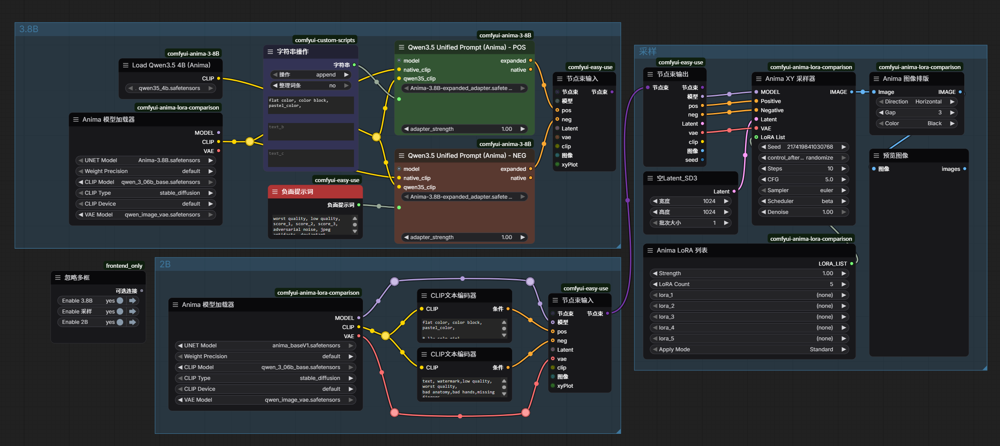

# ComfyUI Anima LoRA Comparison

[中文](README.md)

Batch LoRA comparison plugin for Anima (Cosmos-based) models in ComfyUI.

## Nodes

| Node | Description |
|------|-------------|
| **Anima Model Loader** | UNET + CLIP + VAE all-in-one loader |
| **Anima LoRA List** | Select LoRA from dropdown, unified strength, up to 20. Supports Apply Mode (Standard / Anima 3.8B Bridge) |
| **Anima XY Sampler** | Iterate LoRA list, generate one image per LoRA |
| **Anima Image Grid** | Multi-image layout, horizontal/vertical, adjustable gap and color |

## Installation

```bash
cd ComfyUI/custom_nodes
git clone https://github.com/yunqiankuangyu/comfyui-anima-lora-comparison.git
```

Or install via [ComfyUI Manager](https://github.com/ltdrdata/ComfyUI-Manager) — search for `Anima LoRA XY`.

## Usage

### Basic Wiring



### LoRA List

In the Anima LoRA List node:
- `LoRA Count`: number of LoRAs to compare (1-20)
- `lora_1` ~ `lora_N`: select LoRA files from dropdown
- `Strength`: unified strength for all LoRAs
- `Apply Mode`: choose between Standard and Anima 3.8B Bridge (see below)

### Anima 3.8B Bridge Mode

This plugin supports integration with [comfyui-anima-3-8b-lora-bridge](https://github.com/user/comfyui-anima-3-8b-lora-bridge) to run **LoRAs trained on different Anima model variants on other variants**.

**When to use Bridge mode:**
- Your LoRA was trained on a different Anima model variant than the one you're loading
- Bridge mode remaps the LoRA layers to match the loaded model's architecture

**When to use Standard mode:**
- Your LoRA matches the architecture of the loaded model (no remapping needed)

**Requirements for Bridge mode:**
1. Install [comfyui-anima-3-8b-lora-bridge](https://github.com/user/comfyui-anima-3-8b-lora-bridge) in `custom_nodes/`
2. Load the target model in Anima Model Loader
3. Select "Anima 3.8B Bridge" in the Apply Mode dropdown

### Image Grid

- **Direction**: Horizontal / Vertical
- **Gap**: 0-256 pixels
- **Color**: Black, White, Gray, Red, Green, Blue

## License

MIT
